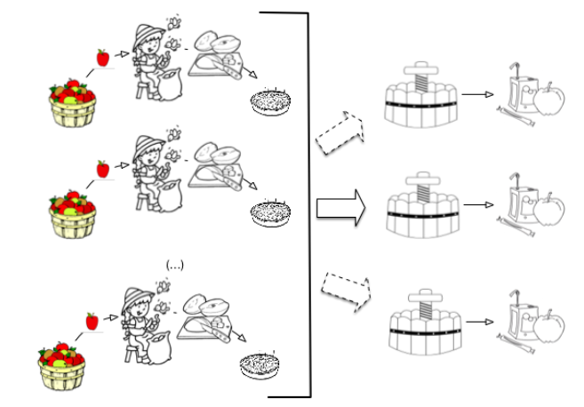
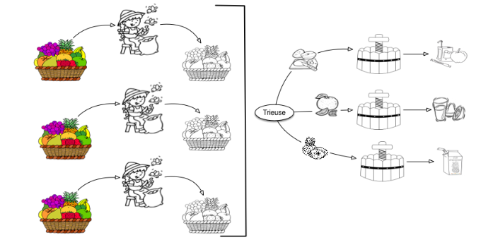
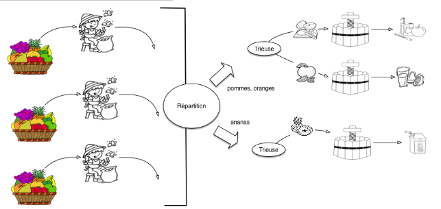

# Map Reduce for data (and big data) processing

We will need processing collections, which we will call the "data processing pipelines". The general principle is to submit each document from a collection to a sequence of operations, such as:

* filtering, keeping the document only if it meets certain criteria;
* restructuring, changing the shape of the document;
* annotation, by adding calculated properties to the document;
* A consolidation with other documents on certain criteria;
* aggregation operations on groups of documents.

The specification of a data processing pipelines is based on a paradigm called MapReduce that we will encounter on a recurring basis. This section is a detailed presentation of the MapReduce calculation principle, and a practical illustration with simple python examples. 
MapReduce is really interesting and powerful in a distributed context. We stick to the centralized context (one server) in the following, which allows us to become familiar with concepts and practice in a simple setting.

## Metaphor for a MapReduce process

Let's get away from IT... This gives us a little time to make a good apple juice. Do you know how to make apple juice? It's simple:

* peeling: the apples should be peeled one by one;
* pressing: you put all the apples in a press, and you get the juice back.

The process is summarized on "Figure i". Let's look at the cook. He has a pile of apple on the left, takes them one by one, peels each apple and places the peeled apple in a pile to the right. When all the apples are peeled (and not before!), we can start the second phase.

 

As our goal is to begin to formalize it into a model that we will call at the end MapReduce, we distinguish precisely the boundary between the two phases, and the tasks performed on each side.

So *on the left*, we have the **processing workshop**: it consists of an agent, the peeler, who takes an apple from his basket to the left, produces an apple peeled in a second basket on the right, and repeats the same action until the basket on the left is empty.

*On the right* we have the **assembly workshop**: we entrust him with a pile of peeled apples and he produces apple juice.

We can already learn two lessons about the essential characteristics of our elementary process. The first relates to the *processing workshop*, which applies an individual operation to each product.

> _Lesson 1_: **The processing workshop** is focused on apples
>>In **the processing workshop**, the apples are peeled individually and in any order.

The peeler does not know how many apples he has to peel, he just draws in the basket as long as it is not empty. Similarly, he does not know what happens to peeled apples, he simply transmits them to the general process.

*The second lesson* is about the **assembly workshop** which, on the contrary, applies a transformation to the products grouped: here, heaps of apples.

>_Lesson 2_: **The assembly workshop** is centered on the piles of apples
>>In the **assembly workshop**, processing is applied to sets of apples.

All this is quite basic, let's see if we can do better by introducing a first variant. Instead of cooking whole apples, we prefer to cut them into quarters beforehand. The peeling phase becomes a peeling/cutting phase.

It doesn't make much difference, as figure shows. Instead of having two identical heaps left and right with apples, the cook has a heap with p apples left and another pile with 4p apple wedges on the right.

 

It still allows us to learn a third lesson.

>_Lesson 3_: Processing can change the number and nature of products
>>The first phase is not limited to one-for-one processing of the products consumed. It can take in products of a certain nature (apples), take out products of another nature (peeled apple wedges), and there may be no fixed relationship between the number of products out and the number of products in inputs (you can throw rotten apples, cut a small apple in 4 or 6, a big apple in 8, etc.).

We have our first MapReduce process, and we have identified its main characteristics. It becomes possible to show how to **go on a large scale** in the production of apple juice, **without changing the process**.

### Lots of apple juice
Your apple juice is very good and you have to produce a lot: one person is no longer enough for the task. Fortunately, the method used is easily generalized to a brigade of n peelers.

divide your apple pile into n sub piles, each assigned to a peeler;
Each peeler performs the peeling/cutting task as before;
group the apple wedges together and squeeze them.
It may no longer be enough for a press: in this case, assign c presses and distribute the quarters evenly in each one. Small drawback: you get several barrels of apple juice, one per press, with a possible variable quality. It is probably not very serious.

>**Important**

>Note that this only works because of the features identified by lesson 1 above. If the peeling order was important, for example, it would not be so simple because we would have to be careful what is entrusted to each peeler; Ditto if peeling an apple depended on the peeling of others.

Figure shows the new organization of your two workshops. In the processing workshop, you have n peelers who, each, do exactly the same thing as before: they produce heaps of apple wedges. In the assembly workshop, you have presses: a minimum, 2, 3 or more depending on the need. Warning: there is no reason to impose as a constraint that the number of presses is equal to the number of peelers. You could have a very large press that is enough to occupy 10 peelers.

 

You have paralleled your production of apple juice. Essential note: you don't need to recruit peelers with skills superior to those of your early craft workshop. Each peeler peels his apples and does not need to worry about what others do, how fast they work, etc. You also don't need new and radically more expensive equipment.

You can even claim that economic profitability is preserved. If a peeler peels 50 kgs of apple per day, 10 peelers (with the corresponding material) will produce 500 kgs per day! It's also a matter of material to be assigned to the process: it's clear that if you only have one thrift (the knife that is used to peel) it doesn't work. But if the production of apple juice is profitable with a peeler, it will also be profitable for 10 with the corresponding material. We will say that the process is scalable, and it is worth a fourth lesson.

>Lesson 4: parallelization and scalability (linear)
>>The production of apple juice is parallel and proportional to the resources (human and material) allocated.

Your process has a second important feature (which results from the already making notice that peelers are independent of each other). If a peeler repeatedly sneezes on his apple heap, peels badly or if the apple wedges at the end of the peeling fall to the ground, this does not call into question the entire production but only the small part that was affected by it. You just have to start that part again. Similarly, if a press is improperly set, it does not affect the apple juice prepared in the others and the damage remains local.

>Lesson 5: The process is robust
>>A failure affecting apple juice production has only a local effect and does not call into question the entire production.

Lessons 4 and 5 (**parallelization and robustness**)are the **two essential properties of MapReduce**, a processing model that lends itself well to task distribution. If we think in terms of power or expressiveness, it is still very limited. Can we do better than apple juice? Yes, by adopting the following little generalization.

Why limit to apple juice? If you have a brigade of leading peelers and effective presses, you may also want to consider producing orange juice, pineapple juice, and so on. The process of a double phase of individual processing of ingredients and then of collective elaboration is entirely appropriate, to a close adaptation: since oranges and apples cannot be squeezed together, an initial sorting/grouping step must be added to the assembly workshop.

On the other hand, during the first phase, an undifferentiated pile of apples/oranges/pineapple can be submitted to the same peeler. The lack of specialization here guarantees better use of your brigade, better adaptation to controls, better reactivity to incidents

 

The previous figure shows a configuration of your fruit juice production workshops, with 4 processing workshops, and 1 assembly workshop.

Let's sum up: each peeler has a pile of fruit (apples, oranges, pineapple) to his left. He peels each ingredient, one by one, and transmits them to the assembly workshop. This assembly workshop now includes a sorter that sends each fruit to a homogeneous pile, then transmitted to a dedicated press. The process remains parallelized, with the same scalability properties as before. We just need an extra operation.

A non-trivial issue in general is the criterion of sorting and grouping. In the case of apples, oranges and pineapples, it can be assumed that the operator makes the distinction visually easily. For more subtle cases (you distinguish a variety of Reinette apple from a Jonagold?) we need a more robust method. The products supplied by the assembly workshop must be labelled in advance by the operator of the processing workshop.

>Lesson 6: sorting/grouping phase, labelling
>>If the products are to be processed by category, a sorting/grouping phase should be added at the beginning of the assembly workshop. Sorting is based on a label associated with each input product, indicating the group of belonging.

And finally, how do we set up several assembly workshops? There are two choices:

* Specialize each workshop in one or more categories of fruit;
* do not specialize the workshops, and simply replicate the organization of the previous figure where an assembly workshop knows how to squeeze all types of fruit.
The two choices are probably defended, but in the MapReduce model, it is the specialization (choice 1) that is necessary, for reasons that are due to the properties of data aggregation methods, not always as simple as mixing two orange juices.

In a configuration with several assembly workshops, each is specialized to deal with one or more categories. Of course, you have to make sure that each category is supported by a workshop. This is the role of a new machine, the dispatcher, illustrated by next figure. We have two assembly workshops, the first supporting apples and oranges, and the second the pineapples.

 

It's over! This time we have a complete metaphor for a MapReduce process in a cloud/Big Data context. Let's learn one last lesson before rephrasing it in abstract/computer terms.

>Lesson 7: distribution to assembly workshops
>>If we have several assembly workshops, we need to set up a distribution operation that sends each type of fruit to the specialized workshop. This operation must ensure that each type of fruit has its workshop.

Many variants can be considered that do not call into question the overall model of execution and treatment. A reflection on these variants is proposed in practice.

# The MapReduce model
Let characterize the MapReduce model in computer terms.

_For now, we are only focusing on understanding what a MapReduce treatment means, not how this treatment is performed. We know from the above that it is possible to parallelize it, but it is also quite permissible to run it on a single machine in two steps. This is the scenario we are adopting for now._

The principle of MapReduce is ancient and comes from functional programming. It sums up this way: given a collection of items, each item is applied to an individual transformation process (the so-called **"map"** phase) that produces `labeled` intermediate values. These intermediate values are `grouped by label` and subjected to an assembly function (we will speak more readily of aggregation in computer science) applied to each group (so-called **"Reduce"** phase). The Map phase corresponds to our transformation workshop, the Reduce phase at our assembly workshop.

## Model in detail.

>Item in-entry (document)
>> An entry item is any value capable of being subjected to the transformation function.

In our culinary example, the starters are "raw" fruits: apples, oranges, pineapples, etc. The transformation applied to items is represented by a Map function.

>Map function
>>The Map function, `Fmap`, is applied to each item in the collection, and produces zero, one or more so-called "intermediate" values, placed in an accumulator.

_In our example, `Fmap` is peeling. For the same fruit, several values (neighbourhoods) are produced, none if the fruit is rotten. The accumulator is the pile to the right of the cook._

It is often necessary to partition the values produced by the map into several groups. All you have to do is change the `Fmap` function so that it doesn't emit a value anymore, but associates each value with the group to which it belongs. `Fmap` produces a pair (k, v) for each item, where k is the group identifier and v the value to be placed in the group. The group identifier is determined from the item being processed (this is what we informally called **"label"**)

In the MapReduce model, the data produced by the Map phase is called an intermediate pair.

>Intermediate pair
>>An intermediate pair is produced by the Map function; it is of the form (k, v) where k is the identifier (or key) of a group and v the value extracted from the entry item by `Fmap`.

_For our culinary example, there are three groups, and therefore three possible identifiers: apple, orange, pineapple._

At the end of the Map phase, we have a set of intermediate pairs. Each pair is characterized by the identifier of a group, groups can be grouped on the value of the identifier. We get intermediate groups.

>Intermediate group term
>>An intermediate group is the set of intermediate values associated with the same key value.

_So we'll have the apple quarters group, the orange quarters group, and the pineapple slice group. We then enter the second phase, called Reduce._ The transformation applied to each group is defined by the Reduce function.

>Reduce function
>>The Reduce function, noted `Fred`, is applied to each intermediate group and produces a final value. The final set of values (one for each group) is the result of the MapReduce treatment.

Let's sum up with the next figure, and now we're in the context of our documentary bases. We have a collection of documents d1,d2,,dn (I will note d(i)). The Fmap function produces intermediate pairs in the form of d(g,i) documents, whose identifier (g) refers to the group of belonging. Note: an entry document can generate several documents coming out of the map. Fmap places each d(g,i) in a Gg group. When the map phase is over (and not before!), we can move on to the reduce phase that successively applies Fred to the documents of each group. For each group, a value (a document in general) is obtained Vj.

