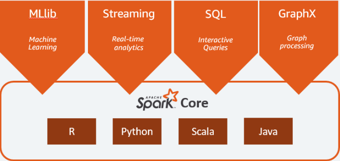

# Why Spark? basic concepts

There is many package provided in the Python ecosystem for data analytic and machine learning, so why bother with Spark?

## Big Data 

> Industry estimates that we are creating more than 2.5 Quintillion bytes of data every year.
> Quintillion 	Thousand (103) of Million (106) of Billion (109) = 1018 byte/year nearly 1 Trillion (1012) byte by second!

### Challenges while working with big data

An example : mean of the grade of a class.

* Easy for one class.
* Still easy for all class of department
* need organisation for all class of an university
* of all university of a town, how to collect where to store? (start speaking of big data?)
* of a country
* of all the world! surly big data

## What is Apache Spark?
Apache Spark is an open-source, distributed processing system used for big data workloads. It utilizes in-memory caching, and optimized query execution for fast analytic queries against data of any size. It provides development APIs in Java, Scala, Python and R, and supports code reuse across multiple workloads—batch processing, interactive queries, real-time analytics, machine learning, and graph processing. You’ll find it used by organizations from any industry, including at FINRA, Yelp, Zillow, DataXu, Urban Institute, and CrowdStrike. Apache Spark has become one of the most popular big data distributed processing framework with 365,000 meetup members in 2017.

### The Spark framework includes:

* Spark Core as the foundation for the platform
* Spark SQL for interactive queries
* Spark Streaming for real-time analytics
* Spark MLlib for machine learning
* Spark GraphX for graph processing

### Features of Apache Spark
#### Apache Spark has following features.

**Speed** − Spark helps to run an application in Hadoop cluster, up to 100 times faster in memory, and 10 times faster when running on disk. This is possible by reducing number of read/write operations to disk. It stores the intermediate processing data in memory.

**Supports multiple languages** − Spark provides built-in APIs in Java, Scala, or Python. Therefore, you can write applications in different languages. Spark comes up with 80 high-level operators for interactive querying.

**Advanced Analytics** − Spark not only supports ‘Map’ and ‘reduce’. It also supports SQL queries, Streaming data, Machine learning (ML), and Graph algorithms.

So Apache Spark is a lightning fast real-time processing framework. It does in-memory computations to analyze data in real-time. It came into picture as Apache Hadoop MapReduce was performing batch processing only and lacked a real-time processing feature. Hence, Apache Spark was introduced as it can perform stream processing in real-time and can also take care of batch processing.

Apart from real-time and batch processing, Apache Spark supports interactive queries and iterative algorithms also. Apache Spark has its own cluster manager, where it can host its application. It leverages Apache Hadoop for both storage and processing. It uses HDFS (Hadoop Distributed File system) for storage and it can run Spark applications on YARN as well.

### Python and Spark = PySpark – Overview
Apache Spark is written in Scala programming language. To support Python with Spark, Apache Spark Community released a tool, PySpark. Using PySpark, you can work with RDDs in Python programming language also. It is because of a library called Py4j that they are able to achieve this.

PySpark offers PySpark Shell which links the Python API to the spark core and initializes the Spark context. Majority of data scientists and analytics experts today use Python because of its rich library set. Integrating Python with Spark is a boon to them.

# [Installing Spark...](install)
# Mastering Big Data Analytics with PySpark [Machine Learning & Data Mining Workshop](/BDA/)