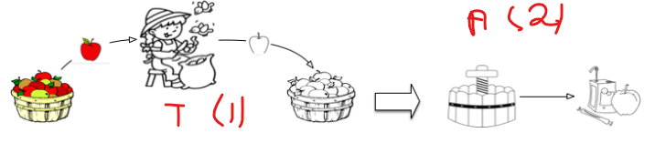

# Map Reduce for data (and big data) processing

We will need processing collections, which we will call the "data processing pipelines". The general principle is to submit each document from a collection to a sequence of operations, such as:

* filtering, keeping the document only if it meets certain criteria;
* restructuring, changing the shape of the document;
* annotation, by adding calculated properties to the document;
* A consolidation with other documents on certain criteria;
* aggregation operations on groups of documents.

The specification of a data processing pipelines is based on a paradigm called MapReduce that we will encounter on a recurring basis. This section is a detailed presentation of the MapReduce calculation principle, and a practical illustration with symple python exemples. 
MapReduce is really interesting and powerfull in a distributed context. We stick to the centralized context (one server) in the following, which allows us to become familiar with concepts and practice in a simple setting.

## MapReduce apple juice
Let's get away from IT... This gives us a little time to make a good apple juice. Do you know how to make apple juice? It's simple:

* peeling: the apples should be peeled one by one;
* pressing: you put all the apples in a press, and you get the juice back.

The process is summarized on "Figure i". Let's look at the cook. He has a pile of apple on the left, takes them one by one, peels each apple and places the peeled apple in a pile to the right. When all the apples are peeled (and not before!), we can start the second phase.

 